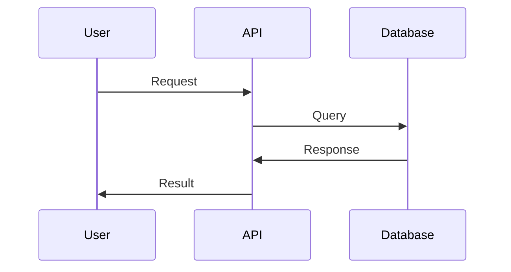

## API Overview

The sicun zhang API allows developers to access core features and integrate them into their applications.

<Tabs>
  <Tab title="Authentication" icon="key">
    <Card title="API Key" icon="shield">
      Generate your API key from the dashboard to authenticate requests.
    </Card>
  </Tab>
  <Tab title="Endpoints" icon="api">
    Explore the various endpoints available for integration.
  </Tab>
</Tabs>

## Authentication

<Callout kind="info">All API requests must be authenticated using an API key.</Callout>

## Request Example

<Request tabs="JavaScript,Python">
  ```javascript
  const response = await fetch('/api/v1/resource', {
    headers: { 'Authorization': 'Bearer YOUR_API_KEY' }
  });
  ```
  ```python
  import requests
  response = requests.get('/api/v1/resource', headers={'Authorization': 'Bearer YOUR_API_KEY'})
  ```
</Request>

## Response Example

<Response tabs="Success,Error">
  ```json
  { "status": "success", "data": { ... } }
  ```
  ```json
  { "error": "Unauthorized", "message": "Invalid API key." }
  ```
</Response>

## Rate Limiting

Ensure you adhere to the rate limits to avoid being blocked.



For more detailed information, please refer to the [API Reference](/api/overview).
