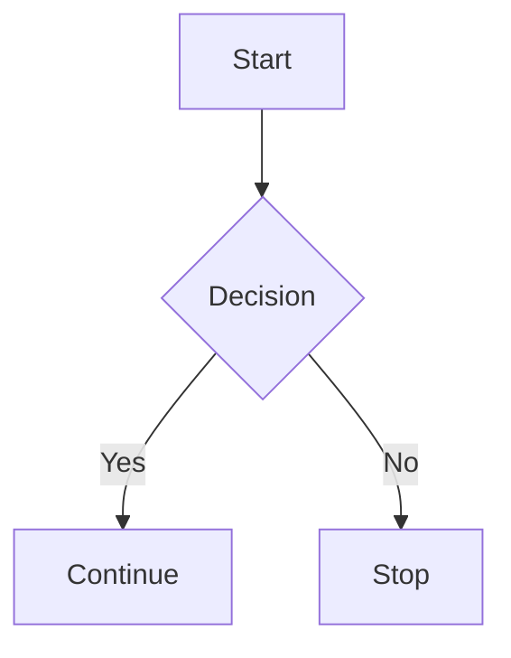

## Welcome to sicun zhang's Documentation

Welcome to the documentation space for sicun zhang. This documentation is designed to help you organize and manage all your project documentation effectively.

<Columns cols={3}>
  <Card title="Getting Started" icon="rocket" href="/getting-started/introduction">
    Learn how to set up and start using sicun zhang.
  </Card>
  <Card title="API Reference" icon="code" href="/api/overview">
    Explore the API endpoints and their usage.
  </Card>
  <Card title="Changelog" icon="clock" href="/changelog">
    View the latest updates and changes.
  </Card>
</Columns>

## Key Features

<Steps>
  <Step title="User Management" icon="users">
    Manage user accounts and permissions with ease.
  </Step>
  <Step title="Advanced Analytics" icon="bar-chart">
    Gain insights with comprehensive data analytics.
  </Step>
  <Step title="Integration Support" icon="plug">
    Seamlessly integrate with third-party services.
  </Step>
</Steps>

## Quick Start

<CodeGroup tabs="JavaScript,Python">
  ```javascript
  const project = new SicunZhang();
  project.initialize();
  ```
  ```python
  from sicun_zhang import Project
  project = Project()
  project.initialize()
  ```
</CodeGroup>

<Callout kind="info">Ensure you have the necessary permissions before proceeding.</Callout>

## Learn More

Explore the different sections of this documentation to get the most out of sicun zhang. Whether you're a developer looking for API details or an end-user seeking guides, this documentation has you covered.


